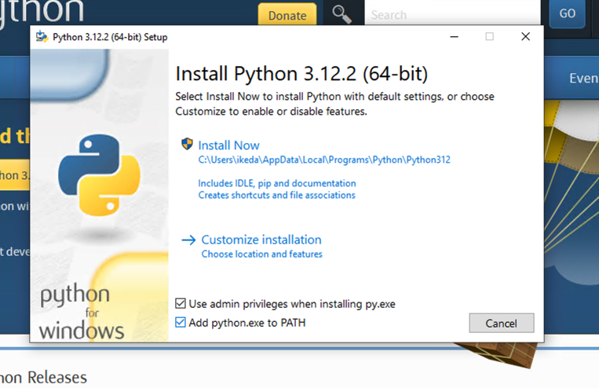
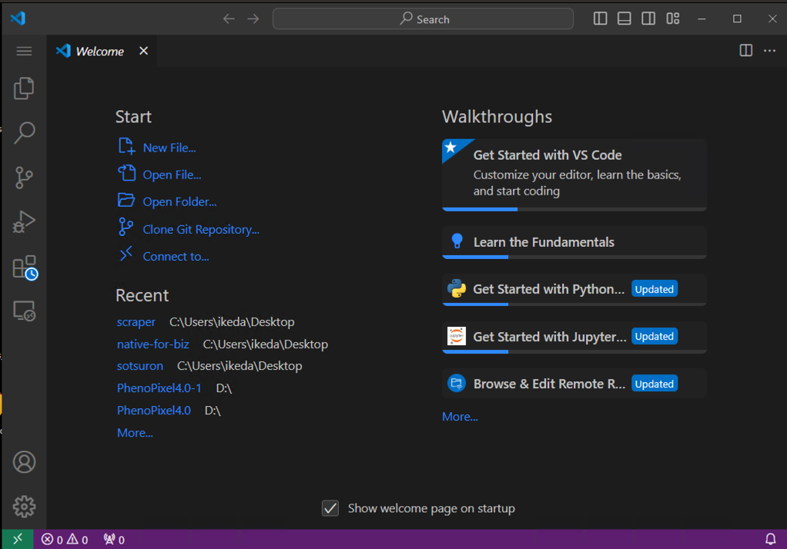
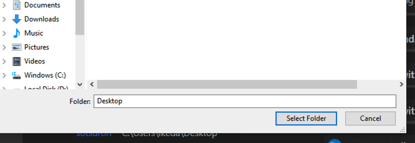
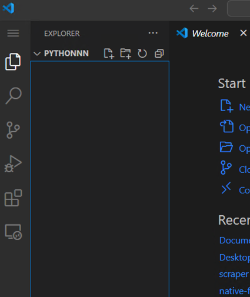
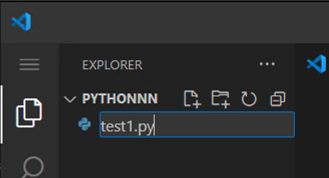
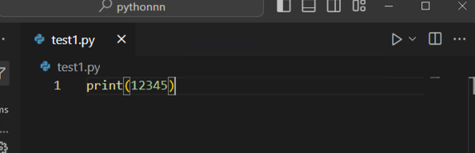
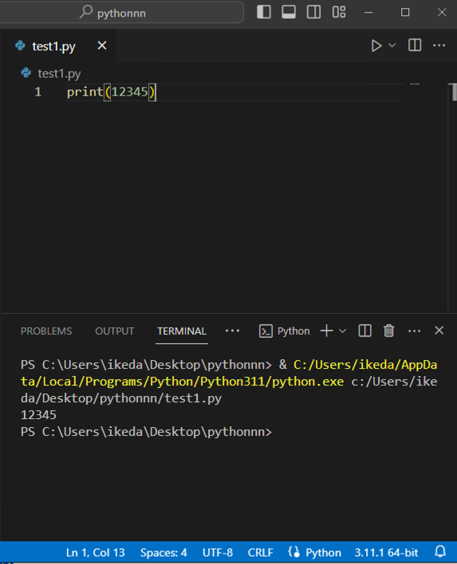

# Python セットアップマニュアル(Windows)

## Pythonのインストール

1. Python公式ページにアクセスする。([Python公式サイト](https://www.python.org/downloads/))

2. 黄色いDownload PythonボタンをクリックしてPythonをダウンロードする。


3. ダウンロード完了後、ファイルを開くと以下のような画面になる。この時、Add python..exe to PATHにチェックが入っていることを確認する。Install Nowを押すとインストールが始まるのでしばらく待つ。



4. Setup was successful と表示されたらPythonのインストールは完了。

## VSCODEのダウンロード&インストール

1. 公式ページからwindows用のvscodeをダウンロード、インストールする。([VSCODEダウンロードページ](https://code.visualstudio.com/download))

2. Windows用をダウンロードする。

3. ダウンロードしたファイルを開き、インストールする。

# Pythonの実行

1. 上記でダウンロードしたVSCODEを開くと、以下のようなスタートアップ画面が表示される。



2. Open folder をクリックして、VSCODEで開くフォルダを選択する。(慣れるまではDesktopを選択するとわかりやすい。)



3. フォルダを選択した後は、画面左上の新規ファイル作成ボタンを押す。(画像では４つのアイコンのうち一番左)



4. 以下のようにpythonファイル（拡張子が.pyのファイル) を作成する。名前は任意。



5. 左側の四角が４つあるアイコンを選び、拡張機能をインストールする。（初回のみ）pythonと検索すると一番上に出てくるものを選択して、installをクリックするだけ。（30秒程度で終了する。）


6. 以下のようにpythonコードを書き、右上の三角の再生ボタンを押してコードを実行する。



下部に出てくるのターミナル（黒い画面）に12345と表示されたら成功。




# 基本構文

## ターミナルに出力

ターミナルに結果を出力する際に使用する。
Matlabのdisplayに値する。

```Python
print(1)
```

## 変数に代入

Pythonは動的型付なのでデータタイプの指定は不要。（明示的に指定することはできる）

```Python
#整数型
x1 = 10
#浮動小数点数
x2 = 10.203
#文字列型
s1 = "string"
s2 = "20.24"
#ブーリアン型
b1 = True
b2 = False
#配列
l1 = [1,2,3]
#辞書
d1 = {1:"1の値",2,"2の値"}

###型アノテーションを明示的に書く場合。
# 整数型
x1: int = 10
# 浮動小数点数
x2: float = 10.203
# 文字列型
s1: str = "string"
s2: str = "20.24"
# ブーリアン型
b1: bool = True
b2: bool = False
# 配列
l1: list = [1,2,3]
# 辞書
d1: dict = {1:"1の値",2:"2の値"}
```
## 四則演算

```Python
# 足し算
x1 = 5 
x2 = 4 
x3 = x1 + x2

### 9 になる。
print(x3) 

# 引き算
x1 = 5 
x2 = 4 
x3 = x2 - x1

### -1 になる。
print(x3)

# 掛け算
x1 = 5 
x2 = 4 
x3 = x1 * x2

### 20 になる。
print(x3)

# 割り算
x1 = 20
x2 = 4 
x3 = x1 / x2

### 5 になる。
print(x3)


# Mod
x1 = 5
x2 = 4 
x3 = x1 % x2

### 1 になる。
print(x3)

```


## 条件構文
ifなどの構文

```Python
a = 1 
b = 2

# 以下の場合は　trueがプリントされる。
if a + b > 2:
    print("true")
elif a + b == 2:
    print("a+b=2")
else:
    print("false")
```

## ループ構文

```Python
#0から99をターミナルに出力(iは任意の変数名)
for i in range(100):
    print(i)

#ループで配列の値を取り出す。
#以下の場合は1から7までの整数が表示される。
arr = [1,2,3,4,5,6,7]
for i in arr:
    print(i)

#while ループ
#True部分がFalseになるまで実行される。
#以下の場合は無限に1を出力。
while True:
    print(1)

#以下の場合は1から7までprintされてループが終了。
# += の記号はvalue = value +　1 と同義
value = 1
while value < 8:
    print(value)
    value += 1
```

## 関数

```Python

#入力値に1を足して返す関数。
def func1(input1: int) -> int:
    return input1 + 1

#上記は以下のように省略して書くことができる。
def func1(input1):
    return input1 + 1
```

## クラス

OOPでpythonを書く場合に使用。(発展版)

```Python

class Cell:
    def __init__(self) -> None:
        self.cell_id = 0
        self.cell_length = 0

    def get_cell_id(self) -> int:
        return self.cell_id

    def get_cell_length(self) -> int:
        return self.cell_length

    def set_cell_id(self, cell_id: int) -> None:
        self.cell_id = cell_id

    def set_cell_length(self, cell_length: int) -> None:
        self.cell_length = cell_length

    def __repr__(self) -> str:
        return f"Cell {self.cell_id} with length {self.cell_length}"

```