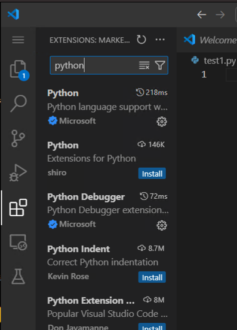

# Python セットアップマニュアル(Windows)

## Pythonのインストール

1. Python公式ページにアクセスする。([Python公式サイト](https://www.python.org/downloads/))

2. 黄色いDownload PythonボタンをクリックしてPythonをダウンロードする。

3. ダウンロード完了後、ファイルを開くと以下のような画面になる。この時、Add python..exe to PATHにチェックが入っていることを確認する。Install Nowを押すとインストールが始まるのでしばらく待つ。

4. Setup was successful と表示されたらPythonのインストールは完了。

## VSCODEのダウンロード&インストール

1. 公式ページからwindows用のvscodeをダウンロード、インストールする。([VSCODEダウンロードページ](https://code.visualstudio.com/download))

2. Windows用をダウンロードする。

3. ダウンロードしたファイルを開き、インストールする。

# Pythonの実行

1. 上記でダウンロードしたVSCODEを開くと、以下のようなスタートアップ画面が表示される。

2. Open folder をクリックして、VSCODEで開くフォルダを選択する。(慣れるまではDesktopを選択するとわかりやすい。)

3. フォルダを選択した後は、画面左上の新規ファイル作成ボタンを押す。(画像では４つのアイコンのうち一番左)

4. 以下のようにpythonファイル（拡張子が.pyのファイル) を作成する。名前は任意。

5. 左側の四角が４つあるアイコンを選び、拡張機能をインストールする。（初回のみ）pythonと検索すると一番上に出てくるものを選択して、installをクリックするだけ。（30秒程度で終了する。）

6. 以下のようにpythonコードを書き、左上の三角の再生ボタンを押してコードを実行する。

下部に出てくるのターミナル（黒い画面）に12345と表示されたら成功。

