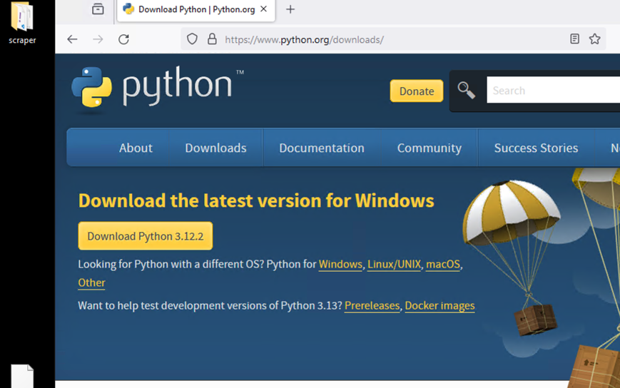

# Python セットアップマニュアル(Windows)

## Pythonのインストール

1. Python公式ページにアクセスする。([Python公式サイト](https://www.python.org/downloads/))

2. 黄色いDownload PythonボタンをクリックしてPythonをダウンロードする。



3. ダウンロード完了後、ファイルを開くと以下のような画面になる。この時、Add python..exe to PATHにチェックが入っていることを確認する。Install Nowを押すとインストールが始まるのでしばらく待つ。


4. Setup was successful と表示されたらPythonのインストールは完了。

## VSCODEのダウンロード&インストール

1. 公式ページからwindows用のvscodeをダウンロード、インストールする。([VSCODEダウンロードページ](https://code.visualstudio.com/download))

2. Windows用をダウンロードする。

3. ダウンロードしたファイルを開き、インストールする。

# Pythonの実行

1. 上記でダウンロードしたVSCODEを開くと、以下のようなスタートアップ画面が表示される。


2. Open folder をクリックして、VSCODEで開くフォルダを選択する。(慣れるまではDesktopを選択するとわかりやすい。)


3. フォルダを選択した後は、画面左上の新規ファイル作成ボタンを押す。(画像では４つのアイコンのうち一番左)


4. 以下のようにpythonファイル（拡張子が.pyのファイル) を作成する。名前は任意。


5. 左側の四角が４つあるアイコンを選び、拡張機能をインストールする。（初回のみ）pythonと検索すると一番上に出てくるものを選択して、installをクリックするだけ。（30秒程度で終了する。）


6. 以下のようにpythonコードを書き、右上の三角の再生ボタンを押してコードを実行する。


下部に出てくるのターミナル（黒い画面）に12345と表示されたら成功。


# 基本構文


## ターミナルに出力

ターミナルに結果を出力する際に使用する。
Matlabのdisplayに値する。

```Python
print(1)
```

## 変数に代入

Pythonは動的型付なのでデータタイプの指定は不要。（明示的に指定することはできる）

```Python
#整数型
x1 = 10
#浮動小数点数
x2 = 10.203
#文字列型
s1 = "string"
s2 = "20.24"
#ブーリアン型
b1 = True
b2 = False
#配列
l1 = [1,2,3]
#辞書
d1 = {1:"1の値",2,"2の値"}
```
# 四則演算

```Python
#足し算
x1 = 5 
x2 = 4 
x3 = x1 + x2

### 9 になる。
print(x3) 


#引き算
x1 = 5 
x2 = 4 
x3 = x1 - x2

### 1 になる。
print(x3)

# 
```


# 条件構文
ifなどの構文
```
a =
```
# ループ構文
for ループ、 whileループ
